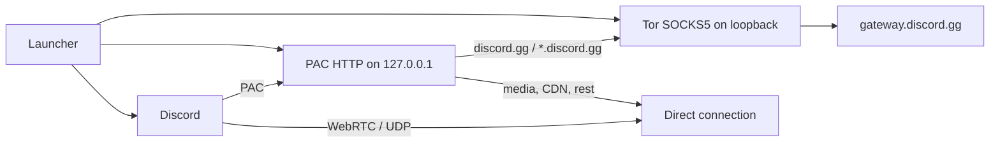

# Discord-Tor — English

<p align="center">
  <strong>EN</strong> ·
  <a href="../pt-br/README.md">PT-BR</a> ·
  <a href="../es/README.md">ES</a>
  &nbsp;·&nbsp;
  <a href="../../README.md">Languages</a>
</p>

> **Discord terms.** Using this software may conflict with the [Discord Terms of Service](https://discord.com/terms) by circumventing a regional restriction. The client is **not modified**; routing the gateway (`discord.gg`) through the Tor network may still be treated as a violation of platform rules.

---

**Discord-Tor** is a minimal launcher for the Discord desktop client. It starts a local Tor instance, serves a PAC on loopback only, and restarts Discord so that **only** `discord.gg` and its subdomains (`gateway.discord.gg`, and so on) leave through SOCKS5. Media (`discord.media`), CDN, WebRTC and every other destination stay `DIRECT`.

There is no process injection, no `app.asar` patch, no public proxy and no project-owned server. The only processes involved are local Tor, a tiny HTTP PAC server, and Discord itself.

### Credits

Based on the [original GoLiveBypass](https://github.com/bezumiya/GoLiveBypass).
I adapted the idea into a version I consider safer for personal use.
Credit to the original project.

What differs from that base is the cut: this variant **does not inject into or alter Discord files**. Routing is signalling-only, through a PAC and Chromium flags the client already accepts.

### Open source

This project is **open source** (GPL-3.0). Want to help? **You are welcome.**

You may also use this codebase as a starting point for your own project, **as long as you give credit** — including to [GoLiveBypass](https://github.com/bezumiya/GoLiveBypass).

### Idea

Discord applies regional restrictions to part of the product (Go Live in particular). Tor lets the **gateway** — the signalling WebSocket on `*.discord.gg` — exit through a circuit whose egress is not the same country as the ISP.

The premise of this adaptation is **minimal surface area**:

- the official client stays untouched;
- only the signalling domain goes through Tor;
- UDP/WebRTC and media stay off the circuit (Tor is not a useful UDP path for this);
- there is no private proxy and no internet infrastructure owned by this repository — egress is the public Tor relay network.

The intended result is a gateway that appears to come from another region, with voice and video on the machine’s direct path.

### How it works

The launcher runs a single lifecycle. While it stays open, Tor and the PAC exist; when Discord closes (or `Ctrl+C` on Fedora), everything is torn down.

1. **Single instance** — one launcher at a time (mutex on Windows, `flock` on Fedora).
2. **Loopback Tor** — SOCKS5 bound only to `127.0.0.1` (port **9060** on Windows, **19060** on Fedora). Policy: accept localhost, reject everything else.
3. **Tunnel proof** — unauthenticated SOCKS5 handshake and TLS 1.2+ to `gateway.discord.gg`, with hostname verification. Discord is not started without it.
4. **Loopback PAC** — HTTP at `127.0.0.1:<ephemeral>/discord-tor.pac`. `FindProxyForURL` returns `SOCKS5` only for `discord.gg` / `*.discord.gg`; any other host is `DIRECT`.
5. **Discord restart** with `--proxy-pac-url=...` and `--force-webrtc-ip-handling-policy=default_public_interface_only`. The second flag stops Chromium from disabling non-proxied UDP merely because a PAC exists — Tor cannot carry UDP, and the Go Live viewer would spin forever.
6. **Supervision** — the launcher stays in the foreground. On Windows, if an update replaces the executable, the PAC is reapplied (up to three handovers). Closing Discord shuts Tor down.



### Architecture

A simple **launcher + Tor + PAC + untouched client** layout:

| Layer | Where | Role |
| --- | --- | --- |
| Fedora entry | `golive-minimal/run-fedora.sh` | System Tor, Python PAC, Flatpak Discord |
| Windows entry | `golive-minimal/cmd/golive-tor` | Two binaries: `DiscordTor.exe` (background) and `DiscordTor-debug.exe` (CMD) |
| PAC | `golive-minimal/internal/pac` and `cmd/fedora/pac_server.py` | Proxy auto-config: only `discord.gg` via Tor |
| Client | `golive-minimal/internal/discord` | Discovers Stable/PTB/Canary and builds Chromium args |
| Tor bundle | `golive-minimal/internal/torbundle` | Windows: downloads the official Tor Expert Bundle, checks SHA-256, extracts `tor.exe` + GeoIP |
| Tunnel check | `golive-minimal/internal/torcheck` | SOCKS5 + TLS to `gateway.discord.gg` |

Typical flow: launcher starts Tor → proves the gateway → serves the PAC → kills and relaunches Discord with the PAC → waits for the client to exit → tears down Tor and PAC.

**Fedora:** system-installed `tor`, PAC in Python 3 (`http.server` on loopback only), Discord via Flatpak `com.discordapp.Discord`. No binary downloads.

**Windows:** Go 1.26.5, **standard library only** (`go.mod` has no dependencies). On first run it downloads the [Tor Expert Bundle](https://archive.torproject.org/) 15.0.20 from `archive.torproject.org`, verifies SHA-256 of the archive and of the three extracted files (`tor.exe`, `geoip`, `geoip6`). There is no Electron, updater, telemetry, or interpolated shell: `tor.exe`, the discovered Discord, `tasklist.exe` and `taskkill.exe` are invoked with separate arguments.

Stack: **Bash** and **Python 3** (Fedora), **Go** (Windows), **Tor**, PAC (`application/x-ns-proxy-autoconfig`), official Discord client.

### How to run

#### Fedora (Discord Flatpak)

**Requirements:** `tor`, `flatpak`, `curl`, `python3`, `flock`; Discord Flatpak (`com.discordapp.Discord`) installed. Do not run as root.

```bash
git clone <repository-url>
cd Discord-Tor

./golive-minimal/run-fedora.sh
```

The script starts Tor, proves SOCKS5 + TLS to `gateway.discord.gg`, serves the PAC on loopback, restarts the Flatpak with that PAC, and stays in the terminal with a print for each step. Closing Discord stops Tor; `Ctrl+C` stops both.

If the SOCKS port (`19060`) is already taken by another Tor, the script closes that process and continues.

Logs live in `Documents/Discord-Tor/discord-tor.log` (the user documents folder): timestamp only for each step, and the full message when something fails.

#### Windows

There are two executables:

- **`DiscordTor.exe`** — runs in the background, no CMD. Shows a **Discord-Tor Iniciado** box; after OK the launcher continues with no window.
- **`DiscordTor-debug.exe`** — opens a CMD with prints for every step (Tor bundle, port, PAC, Discord). Use this if something fails.

**Requirements:** Discord Stable, PTB or Canary installed under `%LOCALAPPDATA%`. On first run, HTTPS access to `archive.torproject.org` (~21 MB).

If the SOCKS port (`9060`) is already taken by another Tor, the launcher closes that process and continues.

Open the `.exe` (CI artifact or local build). The launcher:

1. finds Discord Stable (or PTB/Canary);
2. on first run, downloads the official Tor Expert Bundle 15.0.20, checks SHA-256, and extracts only `tor.exe`, `geoip` and `geoip6`;
3. starts Tor on `127.0.0.1:9060`;
4. proves SOCKS5 + TLS to `gateway.discord.gg`;
5. serves the local PAC and restarts Discord with it;
6. keeps only `discord.gg` / `*.discord.gg` on Tor;
7. reapplies the PAC if an update restarts Discord;
8. stops Tor when Discord closes.

The launcher must remain open while Discord is in use.

### Local state

| Platform | Directory | Contents |
| --- | --- | --- |
| Fedora | `${XDG_STATE_HOME:-$HOME/.local/state}/golive-tor` | `tor-data`, Tor stdout, lock |
| Windows | `%LOCALAPPDATA%\GoLiveBypassTor` | versioned Tor bundle, `torrc`, `tor-data` |
| Both | `Documents/Discord-Tor/discord-tor.log` | timestamp only; on error, timestamp + message |

The Documents log does not record authenticated URLs or credentials. To remove Tor state, close the launcher and Discord and delete only that platform state folder. Discord itself is never changed.

### Scope and limits

- **Signalling vs. media.** Only `discord.gg` goes through Tor. `discord.media`, CDN and WebRTC stay on the machine’s direct path.
- **Public relays.** Internet egress is the public Tor network. This repository does not operate a private proxy or an exit server.
- **Discord terms.** Routing the gateway to circumvent a regional restriction may conflict with platform rules even though the client is unmodified. See the [Terms of Service](https://discord.com/terms).
- **Windows signing.** The binary produced locally or by CI has no Authenticode signature.
- **Instance and lifecycle.** One launcher at a time. On Windows, more than three consecutive Discord restarts (update handover) stop the cycle and require a fresh run.
- **Fedora.** Stable Discord Flatpak is the supported packaging. Other install methods are out of scope.

### Reproducible build (Windows)

Requires Go 1.26.5. The module has no external dependencies.

```powershell
cd golive-minimal
go test ./...
$env:CGO_ENABLED = '0'
go build -trimpath -buildvcs=true -ldflags="-s -w" -o DiscordTor-debug.exe ./cmd/golive-tor
go build -tags silent -trimpath -buildvcs=true -ldflags="-s -w -H=windowsgui" -o DiscordTor.exe ./cmd/golive-tor
Get-FileHash -Algorithm SHA256 .\DiscordTor-debug.exe
Get-FileHash -Algorithm SHA256 .\DiscordTor.exe
```

Cross-build on Linux:

```sh
cd golive-minimal
go test ./...
CGO_ENABLED=0 GOOS=windows GOARCH=amd64 go build -trimpath -buildvcs=true \
  -ldflags='-s -w' -o DiscordTor-debug.exe ./cmd/golive-tor
CGO_ENABLED=0 GOOS=windows GOARCH=amd64 go build -tags silent -trimpath -buildvcs=true \
  -ldflags='-s -w -H=windowsgui' -o DiscordTor.exe ./cmd/golive-tor
sha256sum DiscordTor-debug.exe DiscordTor.exe
```

CI (`.github/workflows/build-minimal.yml`) runs the tests and publishes the `DiscordTor-windows-amd64` artifact with both `.exe` files and SHA-256 alongside them.
