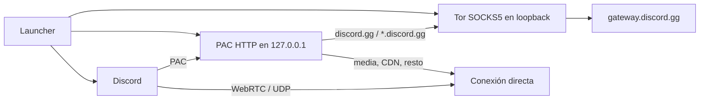

# Discord-Tor — Español

<p align="center">
  <a href="../en/README.md">EN</a> ·
  <a href="../pt-br/README.md">PT-BR</a> ·
  <strong>ES</strong>
  &nbsp;·&nbsp;
  <a href="../../README.md">Idiomas</a>
</p>

> **Términos de Discord.** El uso de este software puede entrar en conflicto con los [Términos de Servicio de Discord](https://discord.com/terms), al eludir una restricción regional. El cliente **no se modifica**; aun así, encaminar el gateway (`discord.gg`) por la red Tor puede interpretarse como una infracción de las reglas de la plataforma.

---

**Discord-Tor** es un launcher mínimo para el cliente de escritorio de Discord. Arranca un Tor local, sirve un PAC solo en loopback y reinicia Discord de modo que **únicamente** `discord.gg` y sus subdominios (`gateway.discord.gg`, etc.) salgan por SOCKS5. Media (`discord.media`), CDN, WebRTC y cualquier otro destino quedan `DIRECT`.

No hay inyección en el proceso, alteración de `app.asar`, proxy público ni servidor propio. Los únicos procesos implicados son el Tor local, un HTTP mínimo para el PAC y el propio Discord.

### Créditos

Basado en el [GoLiveBypass original](https://github.com/bezumiya/GoLiveBypass).
Adapté la idea a una versión que considero más segura para uso personal.
Créditos al proyecto original.

La diferencia respecto a esa base es el recorte: esta variante **no inyecta ni altera archivos de Discord**. El encaminamiento es solo de señalización, mediante un PAC y argumentos de Chromium que el propio cliente ya acepta.

### Open source

El proyecto es **open source** (GPL-3.0). Si quieres participar, **eres bienvenido**.

También puedes usar esta base en tu propio proyecto, **siempre que des los créditos** — incluido [GoLiveBypass](https://github.com/bezumiya/GoLiveBypass).

### Idea

Discord aplica restricciones regionales a parte del producto (en especial Go Live). La red Tor permite que el **gateway** — el canal WebSocket de señalización en `*.discord.gg` — salga por un circuito cuya salida no está en el mismo país que el ISP.

La premisa de esta adaptación es **mínima superficie**:

- el cliente oficial permanece intacto;
- solo el dominio de señalización pasa por Tor;
- UDP/WebRTC y media no entran en el circuito (Tor no transporta UDP de forma útil para esto);
- no existe proxy privado ni infraestructura de este repositorio en internet — la salida es la red pública de relays de Tor.

El resultado esperado es un gateway aparente de otra región, con voz y vídeo en el camino directo de la máquina.

### Funcionamiento

El launcher orquesta un ciclo único. Mientras permanece abierto, existen Tor y el PAC; al cerrar Discord (o `Ctrl+C` en Fedora), todo se termina.

1. **Instancia única** — un solo launcher a la vez (mutex en Windows, `flock` en Fedora).
2. **Tor local en loopback** — SOCKS5 solo en `127.0.0.1` (puerto **9060** en Windows, **19060** en Fedora). Política: aceptar localhost, rechazar el resto.
3. **Prueba de túnel** — handshake SOCKS5 sin autenticación y TLS 1.2+ hasta `gateway.discord.gg`, con verificación de nombre. Sin eso, Discord no se abre.
4. **PAC en loopback** — HTTP en `127.0.0.1:<puerto efímero>/discord-tor.pac`. El script `FindProxyForURL` devuelve `SOCKS5` solo para `discord.gg` / `*.discord.gg`; cualquier otro host es `DIRECT`.
5. **Reinicio de Discord** con `--proxy-pac-url=...` y `--force-webrtc-ip-handling-policy=default_public_interface_only`. El segundo argumento evita que Chromium desactive el UDP no proxied solo porque existe un PAC — Tor no transporta UDP, y el visor de Go Live quedaría en un spinner infinito.
6. **Supervisión** — el launcher permanece en primer plano. En Windows, si una actualización sustituye el ejecutable, el PAC se reaplica (hasta tres handovers). Cerrar Discord termina Tor.



### Arquitectura

Capas simples, estilo **launcher + Tor + PAC + cliente intacto**:

| Capa | Dónde | Rol |
| --- | --- | --- |
| Entrada Fedora | `golive-minimal/run-fedora.sh` | Tor del sistema, PAC Python, Discord Flatpak |
| Entrada Windows | `golive-minimal/cmd/golive-tor` | Dos binarios: `DiscordTor.exe` (background) y `DiscordTor-debug.exe` (CMD) |
| PAC | `golive-minimal/internal/pac` y `cmd/fedora/pac_server.py` | Auto-config de proxy: solo `discord.gg` vía Tor |
| Cliente | `golive-minimal/internal/discord` | Descubre Stable/PTB/Canary y arma los args de Chromium |
| Bundle Tor | `golive-minimal/internal/torbundle` | Windows: descarga el Tor Expert Bundle oficial, verifica SHA-256, extrae `tor.exe` + GeoIP |
| Prueba de túnel | `golive-minimal/internal/torcheck` | SOCKS5 + TLS hasta `gateway.discord.gg` |

Flujo típico: el launcher arranca Tor → prueba el gateway → sirve el PAC → cierra y reabre Discord con el PAC → espera a que el cliente cierre → derriba Tor y PAC.

**Fedora:** Tor instalado por el sistema (`tor`), PAC en Python 3 (`http.server` solo en loopback), Discord vía Flatpak `com.discordapp.Discord`. No descarga binarios.

**Windows:** Go 1.26.5, **solo la biblioteca estándar** (`go.mod` sin dependencias). En la primera ejecución descarga el [Tor Expert Bundle](https://archive.torproject.org/) 15.0.20 desde `archive.torproject.org`, valida SHA-256 del archivo y de los tres ficheros extraídos (`tor.exe`, `geoip`, `geoip6`). No hay Electron, updater, telemetry ni ejecución de shell con string interpolado: `tor.exe`, el Discord encontrado, `tasklist.exe` y `taskkill.exe` se invocan con argumentos separados.

Stack: **Bash** y **Python 3** (Fedora), **Go** (Windows), **Tor**, PAC (`application/x-ns-proxy-autoconfig`), cliente oficial de Discord.

### Cómo ejecutarlo

#### Fedora (Discord Flatpak)

**Requisitos:** `tor`, `flatpak`, `curl`, `python3`, `flock`; Discord Flatpak (`com.discordapp.Discord`) instalado. No ejecutar como root.

```bash
git clone <url-del-repositorio>
cd Discord-Tor

./golive-minimal/run-fedora.sh
```

El script inicia Tor, comprueba SOCKS5 + TLS hasta `gateway.discord.gg`, sirve el PAC en loopback, reinicia el Flatpak con ese PAC y permanece en el terminal con un print en cada etapa. Cerrar Discord termina Tor; `Ctrl+C` termina ambos.

Si el puerto SOCKS (`19060`) ya está ocupado por otro Tor, el script cierra ese proceso y sigue.

Los logs están en `Documentos/Discord-Tor/discord-tor.log` (carpeta de documentos del usuario): solo la hora de cada etapa, y el mensaje completo cuando hay un error.

#### Windows

Hay dos ejecutables:

- **`DiscordTor.exe`** — corre en background, sin CMD. Muestra una caja **Discord-Tor Iniciado**; después de OK el launcher continúa sin ventana.
- **`DiscordTor-debug.exe`** — abre un CMD con prints de cada etapa (bundle Tor, puerto, PAC, Discord). Úsalo si algo falla.

**Requisitos:** Discord Stable, PTB o Canary instalado en `%LOCALAPPDATA%`. En la primera ejecución, acceso HTTPS a `archive.torproject.org` (~21 MB).

Si el puerto SOCKS (`9060`) ya está ocupado por otro Tor, el launcher cierra ese proceso y sigue.

Abre el `.exe` (artefacto del workflow o build local). El launcher:

1. encuentra Discord Stable (o PTB/Canary);
2. en la primera ejecución, descarga el Tor Expert Bundle oficial 15.0.20, comprueba el SHA-256 y extrae solo `tor.exe`, `geoip` y `geoip6`;
3. inicia Tor en `127.0.0.1:9060`;
4. prueba SOCKS5 + TLS hasta `gateway.discord.gg`;
5. sirve el PAC local y reinicia Discord con él;
6. mantiene solo `discord.gg` / `*.discord.gg` en Tor;
7. reaplica el PAC si una actualización reinicia Discord;
8. termina Tor cuando Discord se cierra.

El launcher debe permanecer abierto mientras Discord esté en uso.

### Estado local

| Plataforma | Directorio | Contenido |
| --- | --- | --- |
| Fedora | `${XDG_STATE_HOME:-$HOME/.local/state}/golive-tor` | `tor-data`, stdout de Tor, lock |
| Windows | `%LOCALAPPDATA%\GoLiveBypassTor` | bundle Tor versionado, `torrc`, `tor-data` |
| Ambos | `Documentos/Discord-Tor/discord-tor.log` | solo hora; en error, hora + mensaje |

El log en Documentos no registra URLs autenticadas ni credenciales. Para quitar el estado de Tor, cierra el launcher y Discord y borra solo la carpeta de estado de la plataforma. Discord nunca se altera.

### Alcance y límites

- **Señalización vs. media.** Solo `discord.gg` pasa por Tor. `discord.media`, CDN y WebRTC siguen por la conexión directa de la máquina.
- **Relays públicos.** La salida a internet es la red Tor pública. Este repositorio no opera un proxy privado ni un servidor de salida.
- **Términos de Discord.** Encaminar el gateway para eludir una restricción regional puede entrar en conflicto con las reglas de la plataforma, aunque el cliente no se modifique. Consulta los [Términos de Servicio](https://discord.com/terms).
- **Firma Windows.** El binario generado localmente o por el CI no tiene firma Authenticode.
- **Instancia y ciclo de vida.** Un launcher a la vez. En Windows, más de tres reinicios seguidos de Discord (handover de actualización) interrumpen el ciclo y piden una nueva ejecución.
- **Fedora.** Está cubierto el Discord Flatpak estable. Otros empaquetados quedan fuera de este recorte.

### Build reproducible (Windows)

Requiere Go 1.26.5. El módulo no tiene dependencias externas.

```powershell
cd golive-minimal
go test ./...
$env:CGO_ENABLED = '0'
go build -trimpath -buildvcs=true -ldflags="-s -w" -o DiscordTor-debug.exe ./cmd/golive-tor
go build -tags silent -trimpath -buildvcs=true -ldflags="-s -w -H=windowsgui" -o DiscordTor.exe ./cmd/golive-tor
Get-FileHash -Algorithm SHA256 .\DiscordTor-debug.exe
Get-FileHash -Algorithm SHA256 .\DiscordTor.exe
```

Cross-build en Linux:

```sh
cd golive-minimal
go test ./...
CGO_ENABLED=0 GOOS=windows GOARCH=amd64 go build -trimpath -buildvcs=true \
  -ldflags='-s -w' -o DiscordTor-debug.exe ./cmd/golive-tor
CGO_ENABLED=0 GOOS=windows GOARCH=amd64 go build -tags silent -trimpath -buildvcs=true \
  -ldflags='-s -w -H=windowsgui' -o DiscordTor.exe ./cmd/golive-tor
sha256sum DiscordTor-debug.exe DiscordTor.exe
```

El CI (`.github/workflows/build-minimal.yml`) ejecuta las pruebas y publica el artefato `DiscordTor-windows-amd64` con los dos `.exe` y los SHA-256.
