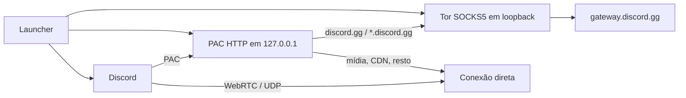

# Discord-Tor — Português (Brasil)

<p align="center">
  <a href="../en/README.md">EN</a> ·
  <strong>PT-BR</strong> ·
  <a href="../es/README.md">ES</a>
  &nbsp;·&nbsp;
  <a href="../../README.md">Idiomas</a>
</p>

> **Termos do Discord.** O uso deste software pode conflitar com os [Termos de Serviço do Discord](https://discord.com/terms), por contornar uma restrição regional. O cliente **não é modificado**; ainda assim, encaminhar o gateway (`discord.gg`) pela rede Tor pode ser interpretado como violação das regras da plataforma.

---

O **Discord-Tor** é um launcher mínimo para o cliente desktop do Discord. Ele sobe um Tor local, serve um PAC só em loopback e reinicia o Discord de modo que **somente** `discord.gg` e os subdomínios (`gateway.discord.gg`, etc.) saiam por SOCKS5. Mídia (`discord.media`), CDN, WebRTC e qualquer outro destino ficam `DIRECT`.

Não há injeção no processo, alteração de `app.asar`, proxy público nem servidor próprio. Os únicos processos envolvidos são o Tor local, um HTTP mínimo para o PAC e o próprio Discord.

### Créditos

Baseado no [GoLiveBypass original](https://github.com/bezumiya/GoLiveBypass).
Adaptei a ideia para uma versão que considero mais segura para meu uso pessoal.
Créditos ao projeto original.

A diferença em relação à base é o recorte: esta variante **não injeta nem altera arquivos do Discord**. O encaminhamento é só de sinalização, via PAC e argumentos do Chromium que o próprio cliente já aceita.

### Open source

O projeto é **open source** (GPL-3.0). Quem quiser participar, **fique à vontade**.

Você também pode pegar esta base para o seu próprio projeto, **desde que dê os créditos** — inclusive ao [GoLiveBypass](https://github.com/bezumiya/GoLiveBypass).

### Ideia

O Discord aplica restrições regionais em parte do produto (em especial o Go Live). A rede Tor permite que o **gateway** — o canal WebSocket de sinalização em `*.discord.gg` — saia por um circuito cuja saída não está no mesmo país do ISP.

A premissa desta adaptação é **mínimo de superfície**:

- o cliente oficial continua intacto;
- só o domínio de sinalização passa pelo Tor;
- UDP/WebRTC e mídia não entram no circuito (o Tor não transporta UDP de forma útil para isso);
- não existe proxy privado nem infraestrutura deste repositório na internet — a saída é a rede pública de relays do Tor.

O resultado esperado é o gateway aparente de outra região, com voz e vídeo no caminho direto da máquina.

### Funcionamento

O launcher orquestra um ciclo único. Enquanto ele estiver aberto, Tor e PAC existem; ao fechar o Discord (ou `Ctrl+C` no Fedora), tudo é encerrado.

1. **Trava de instância** — um único launcher por vez (mutex no Windows, `flock` no Fedora).
2. **Tor local em loopback** — SOCKS5 só em `127.0.0.1` (porta **9060** no Windows, **19060** no Fedora). Política: aceitar localhost, recusar o resto.
3. **Prova de túnel** — handshake SOCKS5 sem autenticação e TLS 1.2+ até `gateway.discord.gg`, com verificação de nome. Sem isso, o Discord não abre.
4. **PAC em loopback** — HTTP em `127.0.0.1:<porta efêmera>/discord-tor.pac`. O script `FindProxyForURL` devolve `SOCKS5` apenas para `discord.gg` / `*.discord.gg`; qualquer outro host é `DIRECT`.
5. **Reinício do Discord** com `--proxy-pac-url=...` e `--force-webrtc-ip-handling-policy=default_public_interface_only`. O segundo argumento evita que o Chromium desligue UDP não-proxied só porque existe um PAC — o Tor não carrega UDP, e o viewer do Go Live ficaria em spinner infinito.
6. **Acompanhamento** — o launcher permanece em primeiro plano. No Windows, se uma atualização do Discord trocar o executável, o PAC é reaplicado (até três handovers). Fechar o Discord encerra o Tor.



### Arquitetura

Camadas simples, no estilo **launcher + Tor + PAC + cliente intacto**:

| Camada | Onde | Papel |
| --- | --- | --- |
| Entrada Fedora | `golive-minimal/run-fedora.sh` | Tor do sistema, PAC Python, Discord Flatpak |
| Entrada Windows | `golive-minimal/cmd/golive-tor` | Dois binários: `DiscordTor.exe` (background) e `DiscordTor-debug.exe` (CMD) |
| PAC | `golive-minimal/internal/pac` e `cmd/fedora/pac_server.py` | Auto-config de proxy: só `discord.gg` via Tor |
| Cliente | `golive-minimal/internal/discord` | Descobre Stable/PTB/Canary e monta os args do Chromium |
| Bundle Tor | `golive-minimal/internal/torbundle` | Windows: baixa o Tor Expert Bundle oficial, confere SHA-256, extrai `tor.exe` + GeoIP |
| Prova de túnel | `golive-minimal/internal/torcheck` | SOCKS5 + TLS até `gateway.discord.gg` |

Fluxo típico: launcher sobe Tor → prova o gateway → serve o PAC → mata e reabre o Discord com o PAC → espera o cliente fechar → derruba Tor e PAC.

**Fedora:** Tor instalado pelo sistema (`tor`), PAC em Python 3 (`http.server` só em loopback), Discord via Flatpak `com.discordapp.Discord`. Não baixa binários.

**Windows:** Go 1.26.5, **somente a biblioteca padrão** (`go.mod` sem dependências). Na primeira execução baixa o [Tor Expert Bundle](https://archive.torproject.org/) 15.0.20 a partir de `archive.torproject.org`, valida SHA-256 do arquivo e dos três arquivos extraídos (`tor.exe`, `geoip`, `geoip6`). Não há Electron, updater, telemetry nem execução de shell com string interpolada: `tor.exe`, o Discord encontrado, `tasklist.exe` e `taskkill.exe` são chamados com argumentos separados.

Stack: **Bash** e **Python 3** (Fedora), **Go** (Windows), **Tor**, PAC (`application/x-ns-proxy-autoconfig`), cliente Discord oficial.

### Como executar

#### Fedora (Discord Flatpak)

**Requisitos:** `tor`, `flatpak`, `curl`, `python3`, `flock`; Discord Flatpak (`com.discordapp.Discord`) instalado. Não execute como root.

```bash
git clone <url-do-repositorio>
cd Discord-Tor

./golive-minimal/run-fedora.sh
```

O script inicia o Tor, comprova SOCKS5 + TLS até `gateway.discord.gg`, serve o PAC em loopback, reinicia o Flatpak com o PAC e permanece no terminal com prints de cada etapa. Fechar o Discord encerra o Tor; `Ctrl+C` encerra ambos.

Se a porta SOCKS (`19060`) já estiver ocupada por outro Tor, o script encerra esse processo e segue.

Logs em `Documentos/Discord-Tor/discord-tor.log` (pasta de documentos do usuário): só o horário de cada etapa, e a mensagem completa quando há erro.

#### Windows

Há dois executáveis:

- **`DiscordTor.exe`** — roda em background, sem CMD. Mostra uma caixa **Discord-Tor Iniciado**; depois de OK o launcher continua sem janela.
- **`DiscordTor-debug.exe`** — abre um CMD com prints de cada etapa (bundle Tor, porta, PAC, Discord). Use este se algo falhar.

**Requisitos:** Discord Stable, PTB ou Canary instalado em `%LOCALAPPDATA%`. Na primeira execução, acesso HTTPS a `archive.torproject.org` (~21 MB).

Se a porta SOCKS (`9060`) já estiver ocupada por outro Tor, o launcher encerra esse processo e segue.

Abra o `.exe` (artefato do workflow ou build local). O launcher:

1. encontra Discord Stable (ou PTB/Canary);
2. na primeira execução, baixa o Tor Expert Bundle oficial 15.0.20, confere o SHA-256 e extrai somente `tor.exe`, `geoip` e `geoip6`;
3. inicia o Tor em `127.0.0.1:9060`;
4. prova SOCKS5 + TLS até `gateway.discord.gg`;
5. serve o PAC local e reinicia o Discord com ele;
6. mantém somente `discord.gg` / `*.discord.gg` no Tor;
7. reaplica o PAC se uma atualização reiniciar o Discord;
8. encerra o Tor quando o Discord fecha.

O launcher precisa continuar aberto enquanto o Discord estiver em uso.

### Estado local

| Plataforma | Diretório | Conteúdo |
| --- | --- | --- |
| Fedora | `${XDG_STATE_HOME:-$HOME/.local/state}/golive-tor` | `tor-data`, stdout do Tor, lock |
| Windows | `%LOCALAPPDATA%\GoLiveBypassTor` | bundle Tor versionado, `torrc`, `tor-data` |
| Ambos | `Documentos/Discord-Tor/discord-tor.log` | só horário; em erro, horário + mensagem |

O log em Documentos não registra URLs autenticadas nem credenciais. Para remover o estado do Tor, feche o launcher e o Discord e apague a pasta de estado da plataforma. O Discord nunca é alterado.

### Escopo e limites

- **Sinalização vs. mídia.** Só `discord.gg` passa pelo Tor. `discord.media`, CDN e WebRTC seguem pela conexão direta da máquina.
- **Relays públicos.** A saída para a internet é a rede Tor pública. Este repositório não opera proxy privado nem servidor de saída.
- **Termos do Discord.** Encaminhar o gateway para contornar restrição regional pode conflitar com as regras da plataforma, mesmo sem modificar o cliente. Consulte os [Termos de Serviço](https://discord.com/terms).
- **Assinatura Windows.** O binário gerado localmente ou pelo CI não possui assinatura Authenticode.
- **Instância e ciclo de vida.** Um launcher por vez. No Windows, mais de três reinícios seguidos do Discord (handover de atualização) interrompem o ciclo e pedem uma nova execução.
- **Fedora.** Coberto o Discord Flatpak estável. Outros empacotamentos não fazem parte deste recorte.

### Build reproduzível (Windows)

Requer Go 1.26.5. O módulo não tem dependências externas.

```powershell
cd golive-minimal
go test ./...
$env:CGO_ENABLED = '0'
go build -trimpath -buildvcs=true -ldflags="-s -w" -o DiscordTor-debug.exe ./cmd/golive-tor
go build -tags silent -trimpath -buildvcs=true -ldflags="-s -w -H=windowsgui" -o DiscordTor.exe ./cmd/golive-tor
Get-FileHash -Algorithm SHA256 .\DiscordTor-debug.exe
Get-FileHash -Algorithm SHA256 .\DiscordTor.exe
```

Cross-build em Linux:

```sh
cd golive-minimal
go test ./...
CGO_ENABLED=0 GOOS=windows GOARCH=amd64 go build -trimpath -buildvcs=true \
  -ldflags='-s -w' -o DiscordTor-debug.exe ./cmd/golive-tor
CGO_ENABLED=0 GOOS=windows GOARCH=amd64 go build -tags silent -trimpath -buildvcs=true \
  -ldflags='-s -w -H=windowsgui' -o DiscordTor.exe ./cmd/golive-tor
sha256sum DiscordTor-debug.exe DiscordTor.exe
```

O CI (`.github/workflows/build-minimal.yml`) roda os testes e publica o artefato `DiscordTor-windows-amd64` com os dois `.exe` e os SHA-256.
